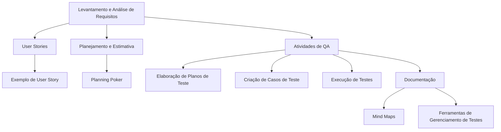

```mermaid
graph TD;

    A[Levantamento e Análise de Requisitos] --> B[User Stories];
    B --> C[Exemplo de User Story];

    D[Planejamento e Estimativa] --> E[Planning Poker];

    F[Atividades de QA] --> G[Elaboração de Planos de Teste];
    F --> H[Criação de Casos de Teste];
    F --> I[Execução de Testes];
    F --> J[Documentação];
    J --> K[Mind Maps];
    J --> L[Ferramentas de Gerenciamento de Testes];

    B:::details Levantar e analisar os requisitos para a criação do projeto. :::;
    C:::details Criar User Stories que representem as funcionalidades desejadas do sistema. :::;
    E:::details Utilizar a técnica de Planning Poker para estimar o esforço das User Stories. :::;
    G:::details Elaborar planos de teste detalhados que descrevam as estratégias de teste a serem seguidas. :::;
    H:::details Criar casos de teste com passos detalhados para verificar a funcionalidade das User Stories. :::;
    I:::details Executar os testes manualmente ou automaticamente para garantir que o sistema atenda aos requisitos. :::;
    J:::details Documentar os resultados dos testes realizados e manter a rastreabilidade dos artefatos de teste. :::;
    K:::details Utilizar Mind Maps para visualizar e organizar as informações relacionadas aos requisitos e testes. :::;
    L:::details Utilizar ferramentas de gerenciamento de testes, como Zephyr Scale, para criar, executar e rastrear testes de forma eficiente. :::;

```
