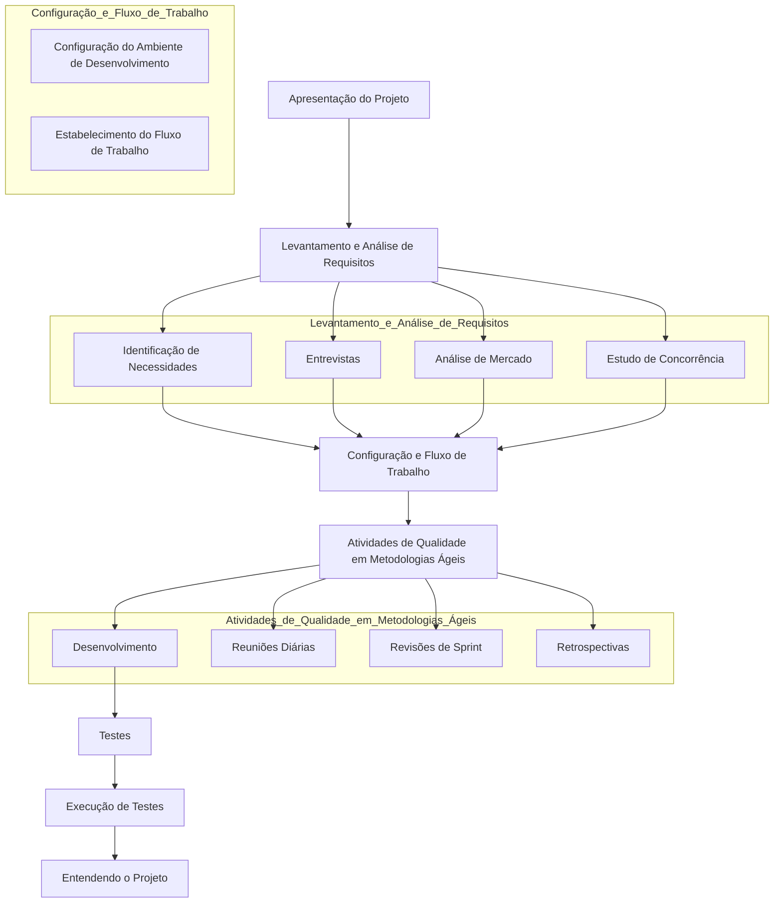
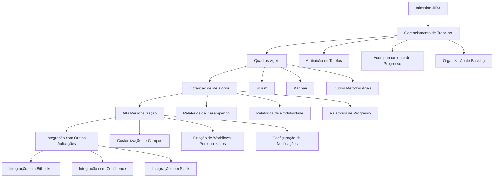
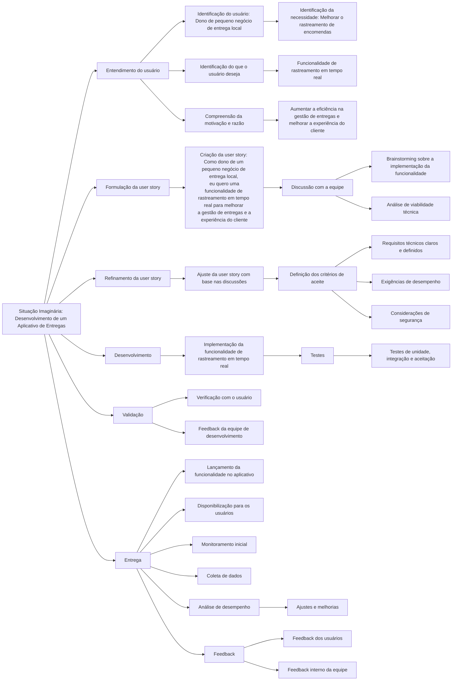
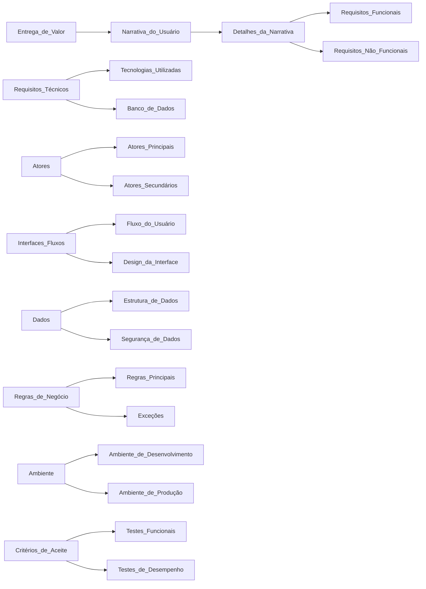
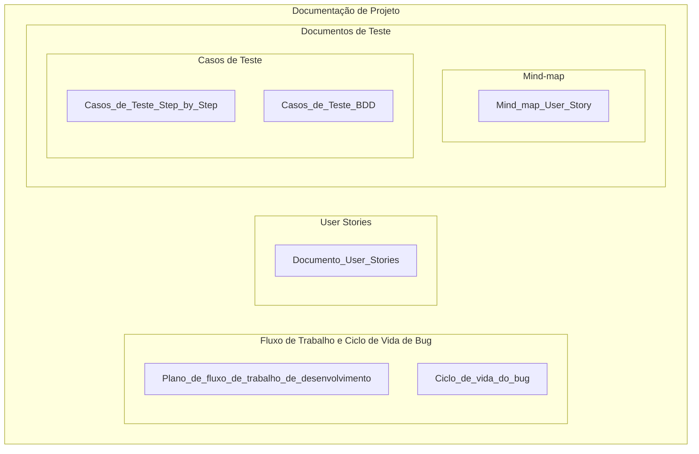
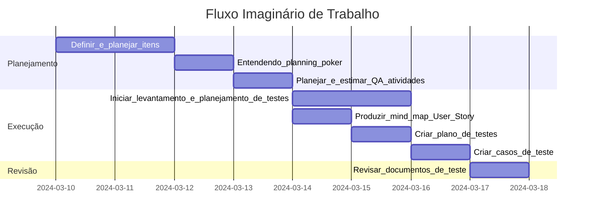
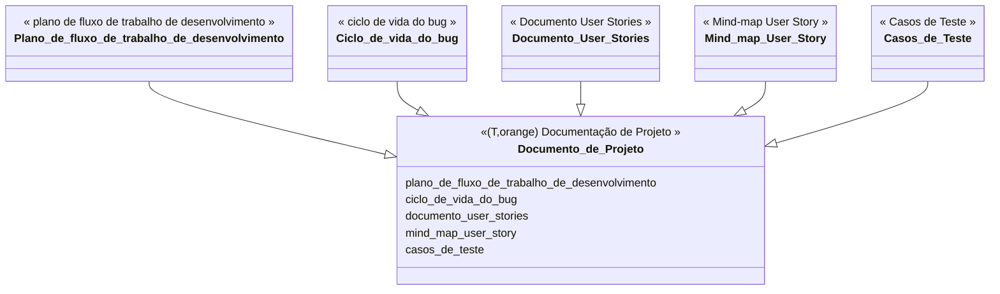

# Fluxo de Desenvolvimento de Projeto Ágil

# Ferramentas para Gerenciamento de Projeto Ágil

# Ciclo de Desenvolvimento de Aplicativo de Entregas

# Estrutura de Desenvolvimento de Aplicativo de Entregas

# Documentação de Projeto: Fluxo de Trabalho e Testes

# Fluxo de Trabalho do Projeto: Planejamento e Execução

# Estrutura de Documentação de Projeto

