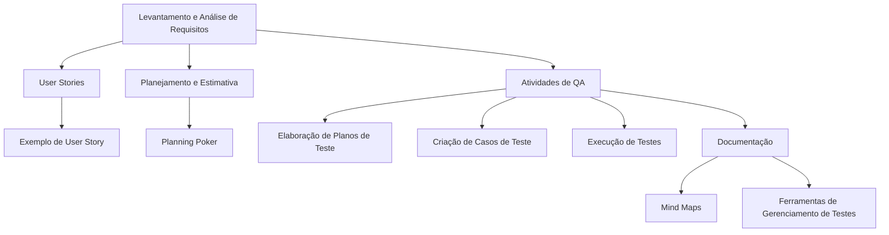

```mermaid
graph TD;
    A[Levantamento e Análise de Requisitos] --> B[User Stories];
    B --> C[Exemplo de User Story];
    A --> D[Planejamento e Estimativa];
    D --> E[Planning Poker];
    A --> F[Atividades de QA];
    F --> G[Elaboração de Planos de Teste];
    F --> H[Criação de Casos de Teste];
    F --> I[Execução de Testes];
    F --> J[Documentação];
    J --> K[Mind Maps];
    J --> L[Ferramentas de Gerenciamento de Testes];
```
